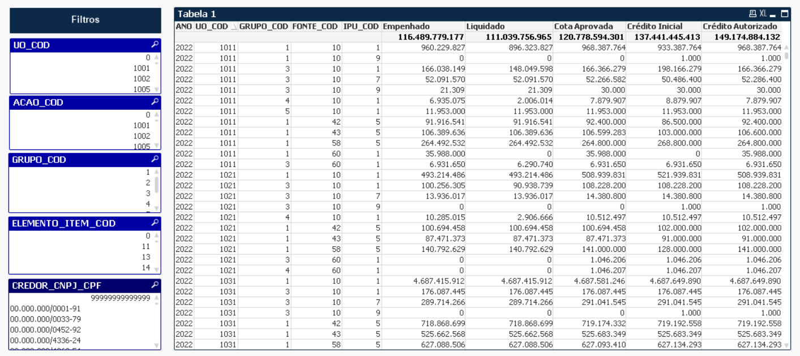

# Introdução 

As bases  que compõem o relatório operacional, painel de dados que utiliza a ferramenta de BI qlikview, são provenientes do [armazém B.O](http://www.armazem.mg.gov.br/), universos SIAFI e SIAD, e também das bases de Restimativa de Despesa e Receita, que atualmente se encontram compartilhadas no OneDrive e são periodicamente atualizadas pelas equipes da DCMEFO e DCAF. 

Essas bases têm como característica apresentar diferentes granularidades (dimensões) nos dados entre elas, em razão das especificidades inerentes a natureza dos fluxos a que pertencem. E como será mostrado ao longo desta nota, isso acarreta em um desafio adicional ao usuário desenvolvedor do qlikview na tarefa de relacioná-las e gerar visualizações.

O objetivo desta nota é apresentar as diferentens granularidades de cada uma das bases, bem como introduzir o método [linktable](QlikView Technical Brief - Concatenate and Link tables.pdf), solução encontrada para tratar essa situação no aplicativo qlikview.

# As diferentes granularidades das bases que alimentam o relatório operacional qlikview:

O qlikview é uma ferramenta de selfservice BI, que permite que usuários com conhecimento de comandos básicos da ferramenta sejam capazes de criar suas próprias visualizações. A forma mais intuitiva, e geralmente mais a utilizada por esses usuários, é empilhar todas as bases que se queira utilizar, por meio do comando `Concatenate` no `Script` do aplicativo. Este método é satisfatório quando inexiste diferença de granularidade nas bases. Entretanto, no caso das bases do relatório operacional, que tem como característica apresentar diferentes granularidades entre suas bases, o empilhamento em uma única base traz alguns problemas, ilustrados no tópico a seguir.

As diferentes granularidades (dimensões) dos dados pode ser verificada por meio do ementário completo das bases do projeto disponível em [data package relatorio operacional](https://gist.github.com/hslinhares/68a3d06eae13b8facb1df42e1095c49e).

# Diferentes granularidades e o uso do método de empilhamento (concatenate) para relacionamento das bases:

Como exemplo do uso do método de empilhamento (concatenate), vamos utilizar as bases Execução da Despesa, Crédito Inicial e Autorizado de Aprovação de Cota Orçamentária do exercício 2022. 

Acessando o `Script` do qlikview, por meio do `ctrl E`, os seguintes passos devem ser seguidos:

## Passo 1: Empilhar as bases mensais da Execução da Despesa 2022:

```default
##cria uma tabela temporária com a execução de todos os meses de 2022.

execucao_temp:
LOAD ANO, 
     MES, 
     UO_COD, 
     UE_COD, 
     UO_FINAN, 
     UPG_COD, 
     EMPENHO_NUM, 
     FUNCAO_COD, 
     ACAO_COD, 
     GRUPO_COD, 
     MODALIDADE_COD, 
     IAG_COD, 
     FONTE_COD, 
     IPU_COD, 
     PROCESSO_NUMERO, 
     CONTRATO_ENTRADA, 
     OBRA_NUMERO, 
     CONTRATO_NUMERO, 
     ELEMENTO_ITEM_COD, 
     ELEMENTO_ORIGEM_DEA_COD, 
     ITEM_ORIGEM_DEA_COD, 
     CREDOR_CNPJ_CPF, 
     DESPESA_EMP, 
     DESPESA_LIQ, 
     DESPESA_PAGA_ORC, 
     DESPESA_PAGA_FIN
FROM
[data-raw\execucao_2022*]
(ooxml, embedded labels, table is base);

``` 
## Passo 2: Empilhar as bases Crédito Inicial e Autorizado, e Aprovação de Cota Orçamentária 2022 na tabela de Execução criada no passo anterior:

```default
## Cria uma tabela com os dados de execução, crédito inicial e autorizado, cota orçamentária e exclui a tabela temporária de execução utilizada para empillhar as bases mensais.

NoConcatenate

execucao:
LOAD ANO, 
     MES, 
     UO_COD, 
     UE_COD, 
     UO_FINAN, 
     UPG_COD, 
     EMPENHO_NUM, 
     FUNCAO_COD, 
     ACAO_COD, 
     GRUPO_COD, 
     MODALIDADE_COD, 
     IAG_COD, 
     FONTE_COD, 
     IPU_COD, 
     PROCESSO_NUMERO, 
     CONTRATO_ENTRADA, 
     OBRA_NUMERO, 
     CONTRATO_NUMERO, 
     ELEMENTO_ITEM_COD, 
     ELEMENTO_ORIGEM_DEA_COD, 
     ITEM_ORIGEM_DEA_COD, 
     CREDOR_CNPJ_CPF, 
     DESPESA_EMP, 
     DESPESA_LIQ, 
     DESPESA_PAGA_ORC, 
     DESPESA_PAGA_FIN
Resident execucao_temp;

Concatenate

credito:
LOAD ANO, 
     UO_COD, 
     PROGRAMA_COD, 
     PROGRAMA_DESC, 
     ACAO_COD, 
     ACAO_DESC, 
     GRUPO_COD, 
     MODALIDADE_COD, 
     IAG_COD, 
     FUNCAO_COD, 
     FUNCAO_DESC, 
     SUBFUNCAO_COD, 
     SUBFUNCAO_DESC, 
     FONTE_COD, 
     IPU_COD, 
     CREDITO_INICIAL, 
     CREDITO_AUTORIZADO
FROM
[data-raw\credito-inicial-autorizado_2022.xlsx]
(ooxml, embedded labels, table is base);

Concatenate

cota:

LOAD [Ano de Exercício] as ANO, 
     Data, 
     [Documento Aprovação Cota], 
     UO_COD, 
     GRUPO_COD, 
     IAG_COD, 
     FONTE_COD, 
     IPU_COD, 
     ACAO_COD, 
     ELEMENTO_ITEM_COD, 
     [Operador - Registro], 
     [COTA APROVADA LIQUIDA]
FROM
[data-raw\cota-item-data_2022.xlsx]
(ooxml, embedded labels, table is base);

drop table execucao_temp; 

```
## Resultado

Após seguir os passos anteriores e dar o comando `ctrl R` no script do qlikview, o resultado será uma tabela única empilhada, verificada por meio do comando `ctrl T` ,que retorna a estrutura da modelagem de dados no aplicativo, vide a figura a seguir:

 [].

## Visualilização dos dados do relatório operacional no método de empilhamento das bases (Concatenate)

Com as bases lidas, dentro da aba de criação de *dashboards* o próximo passo é inserir `Novo Objeto de Pasta` do tipo `Lista` para objetos de filtro e `Gráfico`/`Tabela Simples` para criação da Tabela com os dados desejados.

No exemplo, foi criada uma a Tabela 1 em que são visualizados dados de 2022 de Crédito Orçamentário, Cota Aprovada, Despesa Empenhada e Despesa Liquidada, por Unidade Orçamentária, Grupo de Despesa, Fonte de Recursos e Procedência. E como filtro, as dimensões Unidade Orçamentária, Ação, Grupo de Despesa, Elemento Item de Despesa e CNPJ/CPF do Credor.

 [].

## Utilização dos filtros
