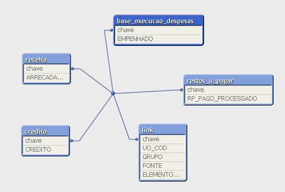

# Introdução

Tabelas fato são a base para qualquer ambiente de análise de dados. Armazenando medidas quantitativas de acontecimentos mensuráveis do negócio, no menor nível de detalhe possível, permitem análises ricas em detalhes, porque seus dados podem ser facilmente agrupados em um ou mais atributos de dimensão, permitindo uma vasta combinação de insigths e questionamentos.[^1]

[^1]: https://decisionworks.com/2003/10/no-detail-too-small/

Cada tabela fato é focada em um processo específico do negócio da organização. Trazendo à realidade da SPLOR, temos diversos processos orçamentários acontecendo no SIAFI e SIAD, alimentando diariamente o armazém de informações, como por exemplo, execução de despesas (empenho, liquidação e pagamento), crédito (crédito inicial da LOA mais créditos adicionais), aprovação de cotas orçamentárias, entre outros.

Cada tabela fato gerada a partir de dados desses processos contém métricas e agregações próprias, mas também compartilham algumas umas com as outras, como por exemplo, unidade orçamentária, ação, grupo, fonte, elemento, item, credor, número de empenho, e etc. Com isso, é possível navegar entre as diversas tabelas e trazer para um relatório as suas métricas agregadas por dimensões em comum, o que se chama *`Drill Across`*, um dos pilares de estudo em Data Warehouse. [^2]

[^2]: https://www.kimballgroup.com/2003/04/the-soul-of-the-data-warehouse-part-two-drilling-across/

As ferramentas de BI, como o powerbi ou qlikview, são grandes facilitadores nesta tarefa, retirando a necessidade de inúmeras manipulações de planilhas para se criar ou atualizar um único relatório. Uma vez que, concluído o trabalho de modelagem dimensional e relacionamento entre tabelas na ferramenta, inúmeros relatórios podem ser facilmente gerados, com diferentes visões do negócio, com dados agregados em diferentes níveis, de rápida atualização e fácil distribuição aos usuários finais da informação. 

Contudo, construir uma modelagem dimensional e relacionar diversas tabelas fato contendo dados agrupados em diferentes dimensões, ou granularidades, não é uma tarefa nada trivial, correspondendo a uma das tarefas mais importantes, senão a mais importante dentro as atividades para construção de um painel de relatórios em BI. Isto porque não há uma regra ou fórmula única a se seguir. 

Cada projeto exige análise e estudo individualizados. É preciso ter em mente quais perguntas que se buscam responder, entender os processos de negócio, como os dados são gerados, as potencialidades e limitações resultantes dos possíveis cruzamentos entre duas ou mais tabelas fato distintas, para por fim poder dar início a este trabalho. Uma modelagem e relacionamentos entre tabelas incorretos levam necessariamente a resultados igualmente incorretos aos relatórios.

O objetivo desta nota é lançar luz nesse sentido, apresentando a solução utilizada no painel relatório operacional qlikview na complexa tarefa de se criar uma modelagem e relacionar diferentes tabelas fato. O painel contém relatórios a partir de dados históricos e atualizados dos principais fluxos orçamentários do estado existentes no armazém de informações, universos SIAFI e SIAD, e da restimativa de receitas e despesas, em diferentes níveis de agregação.

Nas próximas sessões desta nota são apresentados dois métodos de relacionamento entre tabelas, o de [empilhamento ou concatenate](QlikView_Technical_Brief-Concatenate-and-Link-tables.pfd) das bases, que já era utilizao em outro projeto da SPLOR, o painel da reestimativa da DCAF, comparando seus resultados ao utilizado no relatório operacional, o método *[linktable](QlikView_Technical_Brief-Concatenate-and-Link-tables.pdf)*, a fim de justificar escolha por este último neste projeto.

# As diferentes granularidades das bases que alimentam o relatório operacional qlikview:

As diferentes granularidades (dimensões) dos dados do ementário completo de bases utilizadas no projeto do relatório operacional qlikview pode ser verificado no [data package relatorio operacional](https://gist.github.com/hslinhares/68a3d06eae13b8facb1df42e1095c49e).

Nesta nota, para exemplificação dos métodos de relacionamento entre tabelas, são utilizadas pequenos exemplos fictícios de bases que remontam aos fluxos orçamentários reais de execução de despesas, crédito, restos a pagar e receita. 
As tabelas a seguir apresentam os dados utilizados. 

**Tabela execução de despesas:**
```
UO_COD GRUPO FONTE ELEMENTO_ITEM EMPENHADO
1:   1001     3    10          3999       100
2:   1001     4    60          5101       120
```

**Tabela crédito:**
```
UO_COD GRUPO FONTE CREDITO
1:   1001     3    10    1000
2:   1001     4    60    1000
3:   1002     3    60    1000
4:   1003     3    60    1000
```
**Tabela restos a pagar:**
```
   UO_COD GRUPO FONTE ELEMENTO_ITEM RP_PAGO_PROCESSADO
1:   1001     3    10          3333                100
2:   1003     3    60          3999                100
```

**Tabela receita:**
```
  UO_COD FONTE ARRECADADO
1:   1001    10        300
2:   1001    60        300
3:   1002    60        300
4:   1003    60        300
```

Verificam-se  que existem diferentes agregações dos dados entre as tabelas. As bases execução de despesas e restos a pagar contêm a mesma granularidade nos dados entre si (`UO_COD`, `GRUPO`, `FONTE` e `ELEMENTO_ITEM`), diferente da base crédito que não contém a dimensão `ELEMENTO_ITEM` e a base receita que somente contém as dimensões `UO_COD` e `FONTE`.

# Método de empilhamento de tabelas (função Concatenate) no qlikview:

Vale salientar que, o qlikview automaticamente empilha bases com colunas exatamente iguais em nome e quantidade. Quando isto não ocorre, como no exemplo, é necessário forçar o empilhamento por meio da função `Concatenate`, no `Script` da ferramenta, conforme se segue:

## Passo 1: Leitura e empilhamento das bases Execução de Despesas, Crédito, Restos a Pagar e Receita:

```default

execucao_despesas:
LOAD 
     UO_COD, 
     GRUPO_COD, 
     FONTE_COD, 
     ELEMENTO_ITEM_COD, 
     DESPESA_EMP
FROM
[data\execucao.xlsx]
(ooxml, embedded labels, table is base);

Concatenate

credito:
LOAD  
     UO_COD, 
     GRUPO_COD, 
     FONTE_COD, 
     CREDITO
FROM
[data-raw\credito.xlsx]
(ooxml, embedded labels, table is base);

Concatenate

restos_a_pagar:
LOAD  
     UO_COD, 
     GRUPO_COD, 
     FONTE_COD, 
     ELEMENTO_ITEM_COD,
     PAGO_PROCESSADO
FROM
[data-raw\restos_a_pagar.xlsx]
(ooxml, embedded labels, table is base);

Concatenate:

receita:
LOAD UO_COD, 
     FONTE, 
     ARRECADADO
FROM
[data\receita.xlsx]
(ooxml, embedded labels, table is base);

```


## Resultado do método de empilhamento

Após a leitura dos dados, e o resultado será uma única tabela de dados empilhada, que pode ser verificada por meio do comando `ctrl T`.

 

 Clicando com o botão direito sobre esta tabela acima é possível se verificar o conteúdo da tabela empilhada:

 

Observa-se que a tabela empilhada contém todas as colunas de suas tabelas de origem. E nas linhas correspondentes a dados de uma  determinada tabela, onde inexista alguma coluna da tabela empilhada, o seu valor retorna nulo. Por exemplo, a última linha corresponde a dados da tabela receita, em que há dados somente para `UO` e `FONTE`, restando nulo todas as demais colunas.

Com o dados corretamente empilhados podem ser construídos relatórios na ferramenta.

## Criação de *dashboards* para visualização dos dados método de empilhamento das bases (Concatenate):

 

Com as bases lidas, dentro no ambiente de aba de criação de *dashboards* no qlikview, o próximo passo é inserir `Novo Objeto de Pasta` do tipo `Lista` para objetos de filtro e `Gráfico`/`Tabela Simples` para criação da Tabela com os dados desejados. 

No nosso exemplo, construímos uma tabela contendo `UO_COD` e `FONTE` como dimensões, e as métricas de todos os processos orçamentários. 


Filtrando-se por dimensões existentes em todas as bases, por exemplo, `FONTE`, a tabela retorna as medidas existentes agrupadas nesta dimensão no valor selecionado.


Entretanto, quando se filtra por alguma dimensão inexistente em alguma das bases, suas métricas retornam nulo. Como exemplo, ao se filtrar por `ELEMENTO_ITEM` `3999`, os dados  `CREDITO` e `ARRECADADO`retornam  zero (Como *default* o qlikview converte dados nulos em zero nos relatórios). 

Com base na tabela resultante do empilhamento das bases, o  resultado do filtro está de acordo com o esperado, uma vez que, de fato, inexiste a dimensão`ELEMENTO_ITEM` nas tabelas crédito e receita. 

Contudo, o resultado desejado para uso na SPLOR é que ao se filtrar por `ELEMENTO_ITEM` `3999`, o painel também retorne valores de `CREDITO` e `RECEITA` no nível agregação compartilhada entre as bases. Ou seja, como neste `ELEMENTO_ITEM` ocorreu execução de despesas (empenho e pagamento de RP) na `UO_COD` `1001`e `1003`, `GRUPO` `3`,`FONTE` `10` e `60`, o painel deve retornar o total `ARRECADADO` nessas UOs e fontes, e da base crédito o valor do `CREDITO` dessas UOs, fontes e grupo de despesa.

No painel relatorio operacional qlikview esta solução foi atingida a partir de uma adaptação ao método [linktable](QlikView_Technical_Brief-Concatenate-and-Link-tables.pdf) de relacionamento de bases demonstrada a seguir.

# Método *linktable* ou tabela Link:

O método de relacionamento *[linktable](QlikView_Technical_Brief-Concatenate-and-Link-tables.pdf)* consiste empilhar em uma única tabela, chamada `tabela link` ou *`linktable`*,todas as variáveis em comum de todas as tabelas fato. No exemplo, `UO`, `GRUPO`, `FONTE`, e `ELEMENTO_ITEM`, e criar nesta tabela a coluna chave, resultado da concatenação dos valores das outras demais colunas. 

Esta coluna chave também deve ser criada  em cada uma das tabela fato, onde devem restar somente esta coluna e suas respectivas métricas (`CREDITO`, `EMPENHADO`, `PAGO_PROCESSADO` e `ARRECADADO`), e por meio da qual será feita a ligação com a `tabela link`.

# Método *linktable* com uma chave:

## Passo 1: criar nas tabelas fato uma coluna chave correspondente ao seu conjunto de dimensões, deixando para leitura somente esta chave e a métrica.
```
//Cria a chave na tabela fato de Despesa Empenhada e torna as variavéis dimensão como comentário no Script

execucao_despesas:
LOAD 
UO_COD&'|'&GRUPO_COD&'|'&FONTE_COD&'|'&ELEMENTO_ITEM_COD as chave,
LOAD 
     //UO_COD, 
     //GRUPO_COD, 
     //FONTE_COD, 
     //ELEMENTO_ITEM_COD, 
     DESPESA_EMP
FROM
[data\execucao.xlsx]
(ooxml, embedded labels, table is base);
```
```
//Cria a chave na tabela fato de Restos a Pagar e torna as variavéis dimensão como comentário no Script

restos_a_pagar:
LOAD  
UO_COD&'|'&GRUPO_COD&'|'&FONTE_COD&'|'&ELEMENTO_ITEM_COD as chave,
     //UO_COD, 
     //GRUPO_COD, 
     //FONTE_COD, 
     //ELEMENTO_ITEM_COD,
     PAGO_PROCESSADO
FROM
[data-raw\restos_a_pagar.xlsx]
(ooxml, embedded labels, table is base);

```
```
//Cria a chave na tabela fato Crédito e torna as variavéis dimensão como comentário no Script
credito:
UO_COD&'|'&GRUPO_COD&'|'&FONTE_COD as chave
LOAD  
    // UO_COD, 
    // GRUPO_COD, 
    // FONTE_COD, 
     CREDITO
FROM
[data-raw\credito.xlsx]
(ooxml, embedded labels, table is base);
```
```
//Cria a chave na tabela fato Receita e torna as variavéis dimensão como comentário no Script
receita3:
LOAD 
UO_COD&'|'&FONTE as chave,
//UO_COD, 
     //FONTE, 
     ARRECADADO
FROM
[data\receita.xlsx]
(ooxml, embedded labels, table is base);
```
## Passo 2: criar a tabela link empilhando todas as dimensões e coluna chave das tabelas fato. E utilizar a função `distinct` para retirar linhas duplicadas.

```
//cria a tabela link contendo todas as dimensões de todas as bases e cria chave para comunicar com as tabelas fato
//
link:
LOAD 
Distinct
UO_COD&'|'&GRUPO&'|'&FONTE&'|'&ELEMENTO_ITEM as chave,
    UO_COD, 
    GRUPO, 
    FONTE, 
    ELEMENTO_ITEM
     //EMPENHADO
FROM
[data\execucao.xlsx]
(ooxml, embedded labels, table is base);

Concatenate

LOAD
Distinct
UO_COD&'|'&GRUPO&'|'&FONTE&'|'&ELEMENTO_ITEM as chave,
    UO_COD, 
    GRUPO, 
    FONTE, 
     ELEMENTO_ITEM
     //RP_PAGO_PROCESSADO
FROM
[data\restos_a_pagar.xlsx]
(ooxml, embedded labels, table is base);

Concatenate

LOAD 
Distinct
UO_COD&'|'&GRUPO&'|'&FONTE as chave, 
    UO_COD, 
    GRUPO, 
    FONTE
   /// CREDITO
FROM
[data\credito.xlsx]
(ooxml, embedded labels, table is base);

Concatenate

LOAD 
Distinct
null() as chave1,
null () as chave2,
UO_COD&'|'&FONTE as chave3, 
UO_COD,
FONTE
//ARRECADADO
FROM
[data\receita.xlsx]
(ooxml, embedded labels, table is base)
```
## Resultado do método *Linktable* com uma chave:



Conforme imagem do modelo dimensional acima, diferente do método de empilhamento, o método linktable preserva as tabelas fato com suas métricas, ligadas por uma chave à tabela de ligação.


Observando-se os dados armazenados nas tabelas, verifica-se que em cada linha na `tabela link` existe uma chave corresponde a uma linha em um das tabelas fato. Mas poderia, se fosse o caso, ser também uma relação um para muitos.


Ao se filtrar pela dimensão `ELEMENTO_ITEM ` `3999`, o resultado foi o mesmo que ao do método de `empilhamento` das tabelas. Ou seja, os valores das tabelas crédito e receita retornaram nulos. Isto porque em suas chaves não existe esta dimensão.

O caminho seguido para se obter o resultado esperado dos filtros foi observando o `modo automático` do qlikiview, que cria uma espécie de `tabela link com várias chaves`, uma para cada conjunto de dimensões, conforme tópico a seguir.

# Relacionamento entre tabelas automático no qlikview

É importante saber que o qlikview busca automaticamente empilhar bases com colunas do mesmo nome, ou caso sejam diferentes, criar uma espécie de tabela de ligação e chaves sintéticas. Esta solução apesar de disponível e muito utilizada por iniciantes, não é recomendada pelo próprio fabricante[^3], por eventualmente levar a resultados corretos e referências circulares, não se ter controle da modelagem e por consumir mais recursos computacionais, principalmente na existência de grandes e diversas tabelas fato. 

[^3]: https://help.qlik.com/en-US/qlikview/May2023/Subsystems/Client/Content/QV_QlikView/Scripting/synthetic-keys.htm

Porém, para poucas tabelas como no exemplo, a sua utilização é didática para entender o resultado gerado. 

## Resultado do relacionamento entre tabelas automático


Com os dados da nota, a ferramenta foi capaz de entregar o resultado esperado. De forma automática foi criada a tabela `$Syn 6 Table`, análoga a `tabela link` ou `linktable` contendo todas as dimensões, ligadas às tabelas, onde restaram somente as métricas, por chaves específicas para cada tabela de acordo o conjunto de dimensões de cada uma delas.


O resultado do filtro do `ELEMENTO_ITEM` `3999` é de acordo com o esperado pelo usuário da SPLOR, trazendo dados de `CREDITO` e `ARRECADADO`na estrutura orçamentária correspondente existente nessas bases.

O que observou-se no comportamento automático é que são criadas uma chave para cada conjunto de dimensões existentes na tabela fato. Deste modo as tabelas passam a responder ao filtro como desejado. Retornando o dado de cada uma delas no nível de agregação compartilhado com as demais.

# Construção do método linktable no qlikview com multiplas chaves:

A estratégia adotada no relatório operacional foi recriar a estrutura do modo automático mostrado anteriormente, porém por meio de comandos ao `qlikview`, a fim de se ter controle na ferramenta do modelo de dados e se evitar todos os problemas desta função.

## Passo 1: criar nas tabelas fato uma coluna chave específica correspondente a cada conjunto de dimensões, deixando para leitura somente esta chave e a métrica.
```
//Cria a chave na tabela fato de Despesa Empenhada e torna as variavéis dimensão como comentário no Script

execucao_despesas:
LOAD 
UO_COD&'|'&GRUPO_COD&'|'&FONTE_COD&'|'&ELEMENTO_ITEM_COD as chave1,
LOAD 
     //UO_COD, 
     //GRUPO_COD, 
     //FONTE_COD, 
     //ELEMENTO_ITEM_COD, 
     DESPESA_EMP
FROM
[data\execucao.xlsx]
(ooxml, embedded labels, table is base);
```
```
//Cria a chave na tabela fato de Restos a Pagar e torna as variavéis dimensão como comentário no Script

restos_a_pagar:
LOAD  
UO_COD&'|'&GRUPO_COD&'|'&FONTE_COD&'|'&ELEMENTO_ITEM_COD as chave1,
     //UO_COD, 
     //GRUPO_COD, 
     //FONTE_COD, 
     //ELEMENTO_ITEM_COD,
     PAGO_PROCESSADO
FROM
[data-raw\restos_a_pagar.xlsx]
(ooxml, embedded labels, table is base);

```
```
//Cria a chave na tabela fato Crédito e torna as variavéis dimensão como comentário no Script
credito:
UO_COD&'|'&GRUPO_COD&'|'&FONTE_COD as chave2
LOAD  
    // UO_COD, 
    // GRUPO_COD, 
    // FONTE_COD, 
     CREDITO
FROM
[data-raw\credito.xlsx]
(ooxml, embedded labels, table is base);
```
```
//Cria a chave na tabela fato Receita e torna as variavéis dimensão como comentário no Script
receita3:
LOAD 
UO_COD&'|'&FONTE as chave,
//UO_COD, 
     //FONTE, 
     ARRECADADO
FROM
[data\receita.xlsx]
(ooxml, embedded labels, table is base);
```
## Passo 2: criar tabela link empilhando todas as chaves e dimensões das tabelas fato. Utilizar a função `distinct` para retirar linhas duplicadas.

```
//cria a tabela link contendo todas as dimensões de todas as bases e cria chave para comunicar com as tabelas fato
//
link:
LOAD 
Distinct
UO_COD&'|'&GRUPO&'|'&FONTE&'|'&ELEMENTO_ITEM as chave1,
UO_COD&'|'&GRUPO&'|'&FONTE as chave2, 
UO_COD&'|'&FONTE as chave3,
    UO_COD, 
    GRUPO, 
    FONTE, 
    ELEMENTO_ITEM
     //EMPENHADO
FROM
[data\execucao.xlsx]
(ooxml, embedded labels, table is base);

Concatenate

LOAD
Distinct
UO_COD&'|'&GRUPO&'|'&FONTE&'|'&ELEMENTO_ITEM as chave1,
UO_COD&'|'&GRUPO&'|'&FONTE as chave2, 
UO_COD&'|'&FONTE as chave3,
    UO_COD, 
    GRUPO, 
    FONTE, 
     ELEMENTO_ITEM
     //RP_PAGO_PROCESSADO
FROM
[data\restos_a_pagar.xlsx]
(ooxml, embedded labels, table is base);

Concatenate

LOAD 
Distinct
null() as chave1,
UO_COD&'|'&GRUPO&'|'&FONTE as chave2, 
UO_COD&'|'&FONTE as chave3, 
    UO_COD, 
    GRUPO, 
    FONTE
   /// CREDITO
FROM
[data\credito.xlsx]
(ooxml, embedded labels, table is base);

Concatenate

LOAD 
Distinct
null() as chave1,
null () as chave2,
UO_COD&'|'&FONTE as chave3, 
UO_COD,
FONTE
//ARRECADADO
FROM
[data\receita.xlsx]
(ooxml, embedded labels, table is base)
```

## Resultado do método Linktable com múltiplas chaves:


O resultado foi a tabela tabela de ligação ligadas a cada uma das tabelas por meio de chaves específicas para cada uma delas. 


Agora cada linha da `tabela link` contém não apenas uma chave, mas uma para cada conjunto de dimensões existentes em cada tabela. 


Observando-se as tabelas acima é possível verificar o comportamento das tabelas ao se filtrar por alguma dimensão não compartilhada entre todas elas. A `tabela link`, agora contendo todas chaves em cada linha, é capaz de trazer a métrica de todas as tabelas, até o nível de agregação das dimensões existentes em sua respectiva chave. 

# Conclusão

Nesta nota foi relatado o método utilizado no relatório operacional qlikview para relacionamento de suas bases. Um forma que se mostra eficaz para que o conjunto de dados hoje existentes no painel respondam adequadamente às   consultas dos usuários.  Esta solução foi criada a partir do uso prático da ferramenta no dia a dia da rotina orçamentária. Por isso, ainda cabem estudos no sentido de se averiguar a eficiência da modelagem aplicada neste projeto diante do que sugerem as melhores práticas e literatura mais atual no assunto.


