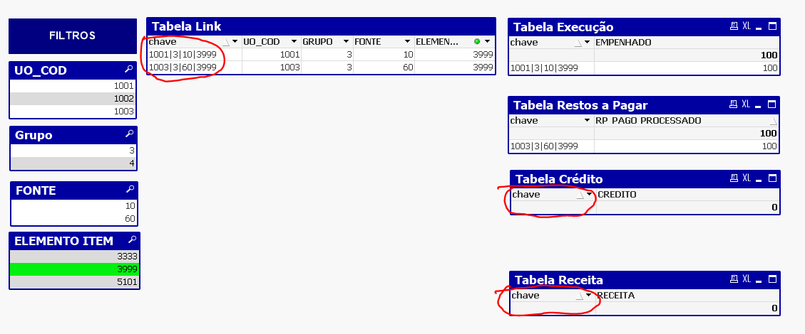

# Introdução 

As bases  que compõem o relatório operacional, painel de dados de uso na SPLOR que utiliza a ferramenta de BI qlikview, são provenientes do [armazém B.O](http://www.armazem.mg.gov.br/), universos SIAFI e SIAD, e também das bases de Restimativa de Despesa e Receita, que atualmente se encontram compartilhadas no OneDrive e são periodicamente atualizadas pelas equipes da DCMEFO e DCAF. 

Essas bases têm como característica apresentar diferentes granularidades (dimensões) nos dados entre elas, em razão das especificidades inerentes a natureza dos fluxos a que pertencem. E como será mostrado ao longo desta nota, isso acarreta em um desafio adicional ao usuário desenvolvedor do qlikview na tarefa de relacioná-las e gerar visualizações.

O objetivo desta nota é apresentar as diferentens granularidades de cada uma das bases, bem como comparar o método de empilhamento das bases (mais intuitivo a usuários iniciantes), com o  método [linktable](QlikView_Technical_Brief-Concatenate-and-Link-tables.pdf), solução encontrada para relacionar as bases do retório operacional.

# As diferentes granularidades das bases que alimentam o relatório operacional qlikview:

O qlikview é uma ferramenta de selfservice BI, que permite que usuários com conhecimento de comandos básicos da ferramenta sejam capazes de criar suas próprias visualizações. A forma mais intuitiva, e geralmente mais a utilizada por esses usuários, é empilhar todas as bases que se deseja utilizar, por meio do comando `Concatenate` no `Script` do aplicativo. Este método é satisfatório quando inexiste diferença de granularidade nas bases. Entretanto, no caso das bases do relatório operacional, que apresentam diferentes granularidades entre suas bases, o empilhamento em uma única base traz problemas ao usuário da ferramenta, ilustrados no tópico a seguir.

As diferentes granularidades (dimensões) dos dados pode ser verificada por meio do ementário completo das bases do projeto disponível em [data package relatorio operacional](https://gist.github.com/hslinhares/68a3d06eae13b8facb1df42e1095c49e).

Para exemplificar os métodos de empilhamento (concatenate) e linktable nesta nota, são utilizados como amostra, as bases de Execução da Despesa, Crédito Inicial e Autorizado, e Aprovação de Cota Orçamentária, todas do exercício 2022 e provenientes do armazém B.O. 

# Empilhamento das bases (método concatenate) no qlikview:

Acessando o `Script` do qlikview, por meio do `ctrl E`, os seguintes passos devem ser seguidos:

## Passo 1: Empilhar as bases mensais da Execução da Despesa 2022:

```default
//cria uma tabela temporária com a execução de todos os meses de 2022.

execucao_temp:
LOAD ANO, 
     MES, 
     UO_COD, 
     UE_COD, 
     UO_FINAN, 
     UPG_COD, 
     EMPENHO_NUM, 
     FUNCAO_COD, 
     ACAO_COD, 
     GRUPO_COD, 
     MODALIDADE_COD, 
     IAG_COD, 
     FONTE_COD, 
     IPU_COD, 
     PROCESSO_NUMERO, 
     CONTRATO_ENTRADA, 
     OBRA_NUMERO, 
     CONTRATO_NUMERO, 
     ELEMENTO_ITEM_COD, 
     ELEMENTO_ORIGEM_DEA_COD, 
     ITEM_ORIGEM_DEA_COD, 
     CREDOR_CNPJ_CPF, 
     DESPESA_EMP, 
     DESPESA_LIQ, 
     DESPESA_PAGA_ORC, 
     DESPESA_PAGA_FIN
FROM
[data-raw\execucao_2022*]
(ooxml, embedded labels, table is base);

``` 
## Passo 2: Empilhar as bases Crédito Inicial e Autorizado, e Aprovação de Cota Orçamentária 2022 na tabela de Execução criada no passo anterior:

```default
//Cria uma tabela com os dados de execução, crédito inicial e autorizado, cota orçamentária e exclui a tabela temporária de execução utilizada para empillhar as bases mensais.

NoConcatenate

execucao:
LOAD ANO, 
     MES, 
     UO_COD, 
     UE_COD, 
     UO_FINAN, 
     UPG_COD, 
     EMPENHO_NUM, 
     FUNCAO_COD, 
     ACAO_COD, 
     GRUPO_COD, 
     MODALIDADE_COD, 
     IAG_COD, 
     FONTE_COD, 
     IPU_COD, 
     PROCESSO_NUMERO, 
     CONTRATO_ENTRADA, 
     OBRA_NUMERO, 
     CONTRATO_NUMERO, 
     ELEMENTO_ITEM_COD, 
     ELEMENTO_ORIGEM_DEA_COD, 
     ITEM_ORIGEM_DEA_COD, 
     CREDOR_CNPJ_CPF, 
     DESPESA_EMP, 
     DESPESA_LIQ, 
     DESPESA_PAGA_ORC, 
     DESPESA_PAGA_FIN
Resident execucao_temp;

Concatenate

credito:
LOAD ANO, 
     UO_COD, 
     ACAO_COD, 
     GRUPO_COD, 
     IAG_COD, 
     FONTE_COD, 
     IPU_COD, 
     CREDITO_INICIAL, 
     CREDITO_AUTORIZADO
FROM
[data-raw\credito-inicial-autorizado_2022.xlsx]
(ooxml, embedded labels, table is base);

Concatenate

cota:

LOAD ANO, 
     UO_COD, 
     GRUPO_COD, 
     IAG_COD, 
     FONTE_COD, 
     IPU_COD, 
     ACAO_COD, 
     ELEMENTO_ITEM_COD, 
     [COTA APROVADA LIQUIDA]
FROM
[data-raw\cota-item-data_2022.xlsx]
(ooxml, embedded labels, table is base);

drop table execucao_temp; 

```
## Resultado

Após seguir os passos anteriores e dar o comando `ctrl R` no script do qlikview para leitura das bases, o resultado será uma única tabela de dados empilhada, que pode ser verificada por meio do comando `ctrl T`, vide figura a seguir:

 [].

## Criação de *dashboards* no método de empilhamento das bases (Concatenate):

Com as bases lidas, dentro da aba de criação de *dashboards* no qlikview, o próximo passo é inserir `Novo Objeto de Pasta` do tipo `Lista` para objetos de filtro e `Gráfico`/`Tabela Simples` para criação da Tabela com os dados desejados.

No exemplo foi criada a Tabela 1 em que são visualizados dados de 2022 de Crédito Orçamentário, Cota Aprovada, Despesa Empenhada e Despesa Liquidada, por Unidade Orçamentária, Grupo de Despesa, Fonte de Recursos e Procedência. E como filtro, as dimensões Unidade Orçamentária (UO_COD), Ação (ACAO_COD), Grupo de Despesa (GRUPO_COD), Elemento Item de Despesa (ELEMENTO_ITEM_COD) e Número do Contrato (CONTRATO_NUMERO).

 [].

## Utilização dos filtros e resultados no método de empilhamento (concatenate)

Nos campos de filtro é possível se fazer a seleção desejada nos dados. Quando se filtra por dimensões existentes em todas as bases, como no exemplo, UO_COD, ACAO_COD ou GRUPO_COD, a tabela retorna valores desejados.

[].

Contudo, quando se filtra por alguma dimensão não existente em alguma das bases da Tabela 1, seus dados retornam zerados. Neste exemplo, ao se filtrar por Elemento Item, os dados de Crédito Inicial e Autorizado retornam zero, por suas bases não conterem esta dimensão.

[].

A visualização mais informativa neste caso seria o retorno do Crédito Inicial e Autorizado na estrutura orçamentária em que houve a execução de despesas no Elemento Item selecionado; neste exemplo, UO_COD = 1501, ACAO_COD = 2500 e GRUPO_COD = 3.

O mesmo problema ocorre ao filtramos por algum contrato. Neste caso, além do Crédito Inicial e Autorizado, a Cota Aprovada também retorna zero, pois inexiste essa dimensão nas bases a que pertencem.
Do mesmo modo, a visualização desejada seria o retorno dos dados de Crédito Inicial e Autorizado e Cota Aprovada, na estrutura orçamentária em que houve a execução da despesa no contrato selecionado.

[].

# Relacionamento de bases por *Linktable* no qlikview:

O método de relacionamento [linktable](QlikView_Technical_Brief-Concatenate-and-Link-tables.pdf) consiste em se juntar em uma única tabela as dimensões de todas as bases (No exemplo: UO, AÇÃO, GRUPO, FONTE, IPU, e etc.), criando-se a tabela dimensão, e por meio de chaves fazer o relacionamento com as tabelas fato, ou seja, os dados do négócio (Crédito Inicial e Autorizado, Cota Aprovada, Despesa Empenhada e Liquidada, e etc.)

#  Método linktable no qlikview

Vamos utilizar as mesmas bases utilizadas no exemplo anterior do método de empilhamento das bases para comparação dos resultados.

Acessando o `Script` do qlikview, por meio do `ctrl E`, os seguintes passos devem ser seguidos:

## Passo 1: Empilhar as bases mensais da Execução da Despesa 2022:

```default
//cria uma tabela temporária com a execução de todos os meses de 2022.

execucao_temp:
LOAD ANO, 
     MES, 
     UO_COD, 
     UE_COD, 
     UO_FINAN, 
     UPG_COD, 
     EMPENHO_NUM, 
     FUNCAO_COD, 
     ACAO_COD, 
     GRUPO_COD, 
     MODALIDADE_COD, 
     IAG_COD, 
     FONTE_COD, 
     IPU_COD, 
     PROCESSO_NUMERO, 
     CONTRATO_ENTRADA, 
     OBRA_NUMERO, 
     CONTRATO_NUMERO, 
     ELEMENTO_ITEM_COD, 
     ELEMENTO_ORIGEM_DEA_COD, 
     ITEM_ORIGEM_DEA_COD, 
     CREDOR_CNPJ_CPF, 
     DESPESA_EMP, 
     DESPESA_LIQ, 
     DESPESA_PAGA_ORC, 
     DESPESA_PAGA_FIN
FROM
[data-raw\execucao_2022*]
(ooxml, embedded labels, table is base);

``` 

```
//Cria a chave1 na tabela fato e torna as variavéis dimensão como comentário no Script

NoConcatenate

execucao:
LOAD 
ANO&'|'&MES&'|'&UO_COD&'|'&UE_COD&'|'&UO_FINAN &'|'&UPG_COD&'|'&EMPENHO_NUM&'|'&FUNCAO_COD&'|'&ACAO_COD&'|'&GRUPO_COD&'|'&MODALIDADE_COD&'|'&IAG_COD&'|'&FONTE_COD&'|'&IPU_COD&'|'&PROCESSO_NUMERO&'|'&CONTRATO_ENTRADA&'|'&OBRA_NUMERO&'|'&CONTRATO_NUMERO&'|'&ELEMENTO_ITEM_COD&'|'&ELEMENTO_ORIGEM_DEA_COD&'|'&ITEM_ORIGEM_DEA_COD&'|'&CREDOR_CNPJ_CPF as chave1,
     //ANO, 
     //MES, 
     //UO_COD, 
     //UE_COD, 
     // UO_FINAN, 
     // UPG_COD, 
     // EMPENHO_NUM, 
     // FUNCAO_COD, 
     //ACAO_COD, 
     // GRUPO_COD, 
     //MODALIDADE_COD, 
     // IAG_COD, 
     // FONTE_COD, 
     //IPU_COD, 
     //PROCESSO_NUMERO, 
     //CONTRATO_ENTRADA, 
     //OBRA_NUMERO, 
     // CONTRATO_NUMERO, 
     // ELEMENTO_ITEM_COD, 
     // ELEMENTO_ORIGEM_DEA_COD, 
     //ITEM_ORIGEM_DEA_COD, 
     // CREDOR_CNPJ_CPF, 
     DESPESA_EMP, 
     DESPESA_LIQ, 
     DESPESA_PAGA_ORC, 
     DESPESA_PAGA_FIN
Resident execucao_temp;

```

```
//Cria a chave2 na tabela fato e torna as variavéis dimensão como comentário no Script

credito:
LOAD
ANO&'|'&UO_COD&'|'&ACAO_COD&'|'&GRUPO_COD&'|'&IAG_COD&'|'&FONTE_COD&'|'&IPU_COD as chave2,
//ANO, 
//UO_COD, 
//ACAO_COD, 
//GRUPO_COD, 
//IAG_COD, 
//FONTE_COD, 
//IPU_COD, 
//CREDITO_INICIAL, 
//CREDITO_AUTORIZADO
FROM
[data-raw\credito-inicial-autorizado_2022.xlsx]
(ooxml, embedded labels, table is base);
```

```
//Cria a chave3 na tabela fato e torna as variavéis dimensão como comentário no Script

cota:
LOAD 
ANO&'|'&UO_COD&'|'&ACAO_COD&'|'&GRUPO_COD&'|'&IAG_COD&'|'&FONTE_COD&'|'&IPU_COD&'|'&ELEMENTO_ITEM_COD as chave3,
//[Ano de Exercício], 
//UO_COD,
//ACAO_COD, 
//GRUPO_COD, 
//IAG_COD, 
//FONTE_COD, 
//IPU_COD, 
//ELEMENTO_ITEM_COD, 
[COTA APROVADA LIQUIDA]
FROM
[data-raw\cota-item-data_2022.xlsx]
(ooxml, embedded labels, table is base);

```
```
//cria a tabela link contendo todas as dimensões de todas as bases e cria chaves para comunicar com as tabelas fato
//inserindo as dimensões da base de Execução de Despesas
NoConcatenate

link:
LOAD Distinct
ANO&'|'&MES&'|'&UO_COD&'|'&UE_COD&'|'&UO_FINAN &'|'&UPG_COD&'|'&EMPENHO_NUM&'|'&FUNCAO_COD&'|'&ACAO_COD&'|'&GRUPO_COD&'|'&MODALIDADE_COD&'|'&IAG_COD&'|'&FONTE_COD&'|'&IPU_COD&'|'&PROCESSO_NUMERO&'|'&CONTRATO_ENTRADA&'|'&OBRA_NUMERO&'|'&CONTRATO_NUMERO&'|'&ELEMENTO_ITEM_COD&'|'&ELEMENTO_ORIGEM_DEA_COD&'|'&ITEM_ORIGEM_DEA_COD&'|'&CREDOR_CNPJ_CPF as chave1, 
ANO&'|'&UO_COD&'|'&ACAO_COD&'|'&GRUPO_COD&'|'&IAG_COD&'|'&FONTE_COD&'|'&IPU_COD as chave2,
ANO&'|'&UO_COD&'|'&ACAO_COD&'|'&GRUPO_COD&'|'&IAG_COD&'|'&FONTE_COD&'|'&IPU_COD&'|'&ELEMENTO_ITEM_COD as chave3,
ANO,
MES,
UO_COD,
UE_COD,
UO_FINAN, 
UPG_COD,
EMPENHO_NUM,
FUNCAO_COD,
ACAO_COD,
GRUPO_COD,
MODALIDADE_COD,
IAG_COD,
FONTE_COD,
IPU_COD,
PROCESSO_NUMERO,
CONTRATO_ENTRADA,
OBRA_NUMERO,
CONTRATO_NUMERO,
ELEMENTO_ITEM_COD,
ELEMENTO_ORIGEM_DEA_COD,
ITEM_ORIGEM_DEA_COD,
CREDOR_CNPJ_CPF
resident execucao_temp;

Concatenate

//cria a tabela link contendo todas as dimensões de todas as bases e cria chaves para comunicar com as tabelas fato
//inserindo as dimensões da base de Crédito Inicial e Autorizado
link:
LOAD Distinct
null() as chave1,
ANO&'|'&UO_COD&'|'&ACAO_COD&'|'&GRUPO_COD&'|'&IAG_COD&'|'&FONTE_COD&'|'&IPU_COD as chave2,
null() as chave3,
ANO,
UO_COD,
ACAO_COD,
GRUPO_COD,
IAG_COD,
FONTE_COD,
IPU_COD 
FROM
[data-raw\credito-inicial-autorizado_2022.xlsx]
(ooxml, embedded labels, table is base);

Concatenate

//cria a tabela link contendo todas as dimensões de todas as bases e cria chaves para comunicar com as tabelas fato
//inserindo as dimensões da base de Cota Aprovada
link:
LOAD Distinct
null () as chave1,
ANO&'|'&UO_COD&'|'&ACAO_COD&'|'&GRUPO_COD&'|'&IAG_COD&'|'&FONTE_COD&'|'&IPU_COD as chave2,
ANO&'|'&UO_COD&'|'&ACAO_COD&'|'&GRUPO_COD&'|'&IAG_COD&'|'&FONTE_COD&'|'&IPU_COD&'|'&ELEMENTO_ITEM_COD as chave3,
ANO,
UO_COD,
ACAO_COD,
GRUPO_COD,
IAG_COD,
FONTE_COD,
IPU_COD,
ELEMENTO_ITEM_COD
FROM
[data-raw\cota-item-data_2022.xlsx]
(ooxml, embedded labels, table is base);


```

## Resultado

Após seguir os passos anteriores e dar o comando `ctrl R` no script do qlikview, o resultado serão uma única tabela dimensão ligada as tabelas fato por meio de chaves, verificada por meio do comando `ctrl T`, conforme figura a seguir:

[].

## Criação de *dashboards* no método *Linktable*:

De maneira análoga ao exemplo anterior de empilhamento de bases, foram utilizados os mesmos campos para criação da Tabela 2 e os filtros. Os dados totais sem filtro são exatamente iguais aos da Tabela 1.

 [].

## Utilização dos filtros e resultados no método *linktable*

Ao se filtrar por alguma dimensão comum entre todas as bases das variáveis que compõem a Tabela 2, o resultado é o mesmo da Tabela 1, retornando dados corretamente.


[].

A diferença entre o método de empilhamento e o linktable ocorre ao se filtrar por alguma dimensão que inexiste em alguma das bases das variáveis que compõem a Tabela 2. Neste Caso, diferente do exemplo da Tabela 1, ao se filtrar por exemplo por Elemento Item, os dados de Crédito Inicial e Autorizado retornarão dados da estrutura orçamentária em que a houve Execução de Despesa, e/ou Aprovação de Cota.

[].

O mesmo ocorre quando se filtra por algum contrato, em que haverá o retorno de dados de Crédito Inicial e Autorizado e Cota Aprovada na estrutura orçamentária em que a Execução da Despesa nesse contrato ocorreu.

[].